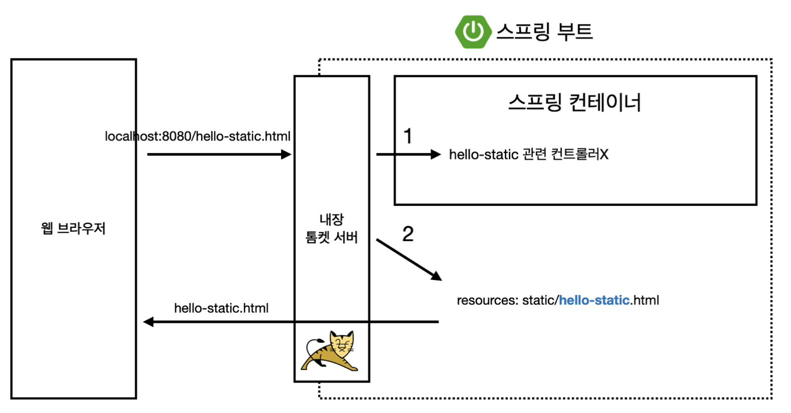
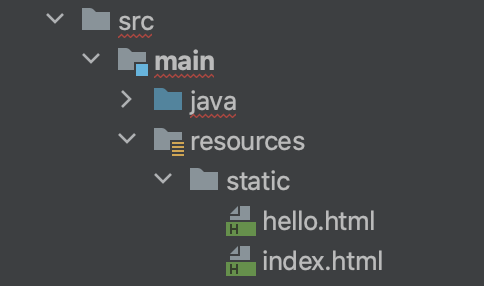
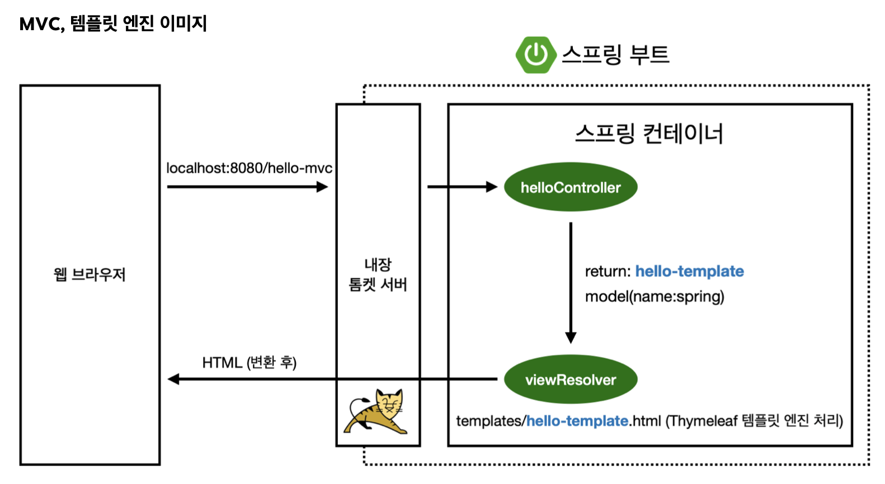
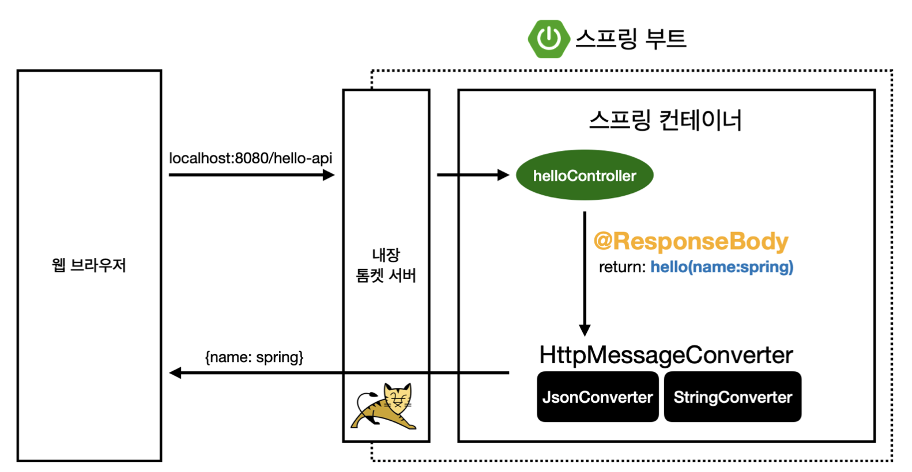

# 섹션 2. 스프링 웹 개발 기초

# 정적 컨텐츠



java spring boot에서는 자동으로 제공을 해준다.

`/static` 이라는 디렉토리 경로안에 있는 `*.html` 형식의 파일을 그대로 불러와서 정적 컨텐츠로 활용이 가능하다고한다.



위와 같이 경로가 되어있을때에는 `url:port` 형식으로 접근을 하면 `index.html`이라는 파일을 참조해서 페이지가 나오게 되고 `url:port/hello` 으로 접근을 하게 되면 `hello.html` 을 참조해서 페이지를 보여준다.

# MVC와 템플릿 엔진



## MVC

[[**java**] MVC](https://www.notion.so/java-MVC-d7b0d462e5864f5aad9686edd9d1d427?pvs=21) 

## 템플릿 엔진

웹 애플리케이션의 동적 컨텐츠를 생성하기 위해 사용되는 도구
html을 바꾸는 역할

전에 이야기가 나왔던 `Thymeleaf`가 템플릿엔진에 해당된다고한다.

## `/static`과 `/templates` 경로 차이점

`static`안에서는 정적 리소스들을 저장하는 경로 ( html, css, img 등 )을 저장을 하고

`templates`경로안에는 동적 웹페이지를 저장하는 경로로 사용이 된다고한다.

## controller는 어떻게 찾아가는가?

controller를 꼭 어느 디렉토리에 넣어야한다는 디렉토리 경로지정이 따로필요하지는 않고, 
`@Controller` 키워드를 사용했으면 `spring boot`에서는 알아서 찾아가서 확인한다고한다.

[[Java] MVC 패턴 자세하게 알아보자!](https://velog.io/@hwsa1004/Java-MVC-패턴)

# API



위에 있는 그림처럼 `controller`에 `@ResponseBody` 가 붙어있으면
controller의 반환형에 따라서 다르게 반환해준다.

### string

```java
@GetMapping("hello-string")
@ResponseBody
public String helloString(@RequestParam("name") String name) {
    return "hello " + name;
}

// return : hello <value>
```

문자형식 그대로를 반환 `string converter` 사용

### object

```java
@GetMapping("hello-api")
@ResponseBody
public Hello helloApi(@RequestParam("name") String name) {
    Hello hello = new Hello();
    hello.setName(name);
    return hello;
}

// return : {"name":<value>}
```

기본적으로는 `json` 형식으로 만들어서 반환해주는 방식 `json converter` 사용